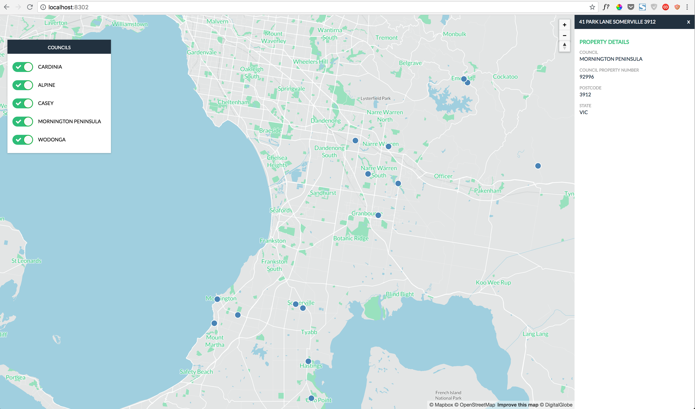

# Landchecker Code Test

The working application.

### Instructions

This project implements the requirments of the landchecker coding challenge. It uses a short node.js scripts to load a postgres database with sample data and exposes a next.js application which serves a react application and json api.

To run the project create a postgres database and enter it's name and your postgres credentials in the file knexfile.js. You may then run the following commands:

1. yarn // install npm packages
2. yarn run init // creates postgres tables and loads sample data
3. yarn run dev // compiles and serves react app and api

You can view the application running on localhost:8302

